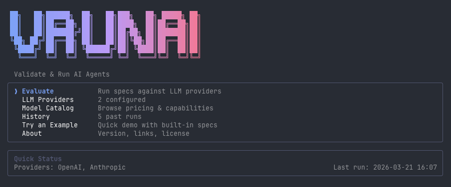
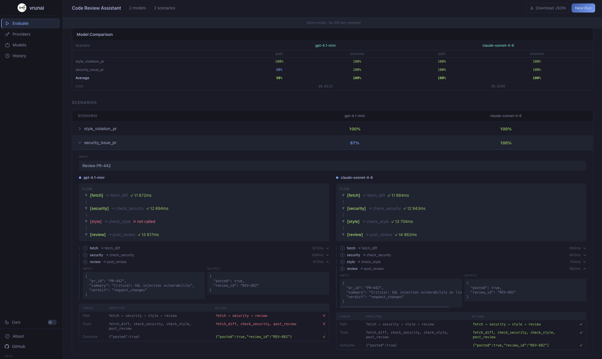

<div align="center">
   
   <h1>VRUNAI</h1>
   <h3>
      Open-source CLI for evaluating LLM agents beyond output accuracy
   </h3>
   <p>
      Define your agent in YAML. Run against any provider. See exactly where it fails.
   </p>

   <div>
      <a href="#-quick-start"><strong>Quick Start</strong></a> ·
      <a href="#-agent-definition-language"><strong>YAML Spec</strong></a> ·
      <a href="#-model-catalog"><strong>Model Catalog</strong></a> ·
      <a href="https://github.com/vrunai/vrunai/issues"><strong>Report Bug</strong></a> ·
      <a href="https://github.com/vrunai/vrunai/issues"><strong>Feature Request</strong></a>
   </div>
   <br/>
</div>

<p align="center">
   <a href="https://github.com/vrunai/vrunai/blob/main/LICENSE">
      
   </a>
   <a href="https://www.npmjs.com/package/vrunai">
      
   </a>
</p>

## The Problem

Most teams evaluate agents by checking the final output. But agents can produce the correct result via the wrong path - skipping tool calls, hallucinating intermediate values, or taking shortcuts that work in testing but fail in production.

VRUNAI tracks **path accuracy**, **tool accuracy**, and **outcome accuracy** separately — and catches bugs that output-only evaluation misses.

<p align="center">
   
</p>

<p align="center"><em>TUI - side-by-side evaluation results across providers</em></p>

<p align="center">
   
</p>

<p align="center"><em>Web UI - scenario & flow preview before running evaluation</em></p>

## ✨ Core Features

- **Path Accuracy** — Did the agent follow the expected execution path? Catches agents that reach the right answer through the wrong steps.

- **Tool Accuracy** — Were the right tools called in the right order? Detects skipped, hallucinated, or misordered tool calls.

- **Outcome Accuracy** — Did the agent produce the correct final output? Classic output evaluation, but now in context.

- **Consistency Scoring** — Run each scenario N times and measure how often the agent takes the same path. Surface non-deterministic behavior before it hits production.

- **Multi-Provider Comparison** — Run the same scenarios against OpenAI, Anthropic, Google, xAI, DeepSeek, and Mistral simultaneously. Compare results, costs, and traces side by side.

- **Cost Tracking** — Real-time cost calculation per scenario per provider based on token usage and model pricing. 26 built-in models with pricing included.

- **Agent Definition Language (ADL)** — YAML-based spec format with tools, mock data, conditional flows, and test scenarios. No code required to define and evaluate an agent.

## 🚀 Quick Start

```bash
npm install -g vrunai
vrunai          # Launch the interactive TUI
vrunai web      # Launch the web UI at http://localhost:3120
```

The TUI and web UI share the same evaluation engine. Configure your LLM providers, load a YAML spec, and run evaluations.

## 📝 Agent Definition Language

Define your agent, tools, execution flow, and test scenarios in a single YAML file:

```yaml
agent:
  name: "Customer Support Triage"
  description: "Classifies inquiries, checks order status, issues refunds or escalates"
  instruction: "You are a customer support assistant..."

tools:
  - name: "classify_inquiry"
    description: "Classifies the customer inquiry by type and urgency"
    input: { message: "string" }
    output: { type: "string", urgency: "string", confidence: "number" }
    mock:
      - input: { message: "My order hasn't arrived after 14 days" }
        output: { type: "late_delivery", urgency: "high", confidence: 0.94 }

  - name: "lookup_order"
    description: "Looks up order status and refund eligibility"
    input: { order_id: "string", inquiry_type: "string" }
    output: { found: "boolean", status: "string", eligible_for_refund: "boolean" }
    mock:
      - input: { order_id: "ORD-8821", inquiry_type: "late_delivery" }
        output: { found: true, status: "in_transit", eligible_for_refund: true }

  - name: "issue_refund"
    description: "Issues an automatic refund"
    input: { order_id: "string", reason: "string", customer_id: "string" }
    output: { success: "boolean", refund_id: "string" }
    mock:
      - input: { order_id: "ORD-8821", reason: "late_delivery", customer_id: "CUST-1142" }
        output: { success: true, refund_id: "REF-5501" }

flow:
  - step: "classify"
    tool: "classify_inquiry"
    input_from: "user_input"
  - step: "lookup"
    tool: "lookup_order"
    input_from: "classify"
  - step: "route"
    condition:
      if: "lookup.output.eligible_for_refund == true"
      then: "auto_refund"
      else: "escalate"
  - step: "auto_refund"
    tool: "issue_refund"
    input_from: "lookup"

scenarios:
  - name: "late_delivery_auto_refund"
    input: "My order #ORD-8821 hasn't arrived after 14 days"
    context: { order_id: "ORD-8821", customer_id: "CUST-1142" }
    expected_path: ["classify", "lookup", "auto_refund"]
    expected_tools: ["classify_inquiry", "lookup_order", "issue_refund"]
    expected_outcome: { success: true }

providers:
  - name: "openai"
    model: "gpt-4o"
  - name: "anthropic"
    model: "claude-sonnet-4-20250514"

scoring:
  runs_per_scenario: 3
```

### Spec Reference

| Key | Required | Description |
|-----|----------|-------------|
| `agent.name` | yes | Display name |
| `agent.description` | yes | Short description of what the agent does |
| `agent.instruction` | yes | System prompt sent to the model |
| `tools[]` | yes | Tool definitions with input/output schemas and mock data |
| `tools[].mock[]` | yes | Input/output pairs used instead of real tool calls |
| `flow[]` | yes | Ordered steps; each maps to a tool or a conditional branch |
| `flow[].condition` | no | `if`/`then`/`else` branch based on a previous step's output |
| `scenarios[]` | yes | Test cases: input, context, expected path/tools/outcome |
| `scenarios[].mock_override` | no | Per-scenario override of a tool's mock output |
| `providers[]` | yes | Models to evaluate; matched against configured API keys |
| `scoring.runs_per_scenario` | no | Times to run each scenario (default: 1) |

## 📊 What VRUNAI Evaluates

| Metric | What it measures |
|--------|-----------------|
| **Path accuracy** | Did the agent follow the expected execution path? |
| **Tool accuracy** | Were the right tools called in the right order? |
| **Outcome accuracy** | Did the agent produce the correct final output? |
| **Consistency** | How often does the agent take the same path across N runs? |
| **Latency** | Average response time per scenario |
| **Cost** | Total cost per scenario per provider |

## 🔌 Supported Providers

<p align="center">
   
   
   
   
   
   
   
</p>

All models from these providers are supported. Custom base URLs are available for local or self-hosted models.

## 🗂 Model Catalog

26 built-in models with pricing and context window info. Override or add your own via `~/.config/vrunai/models.json`:

```json
[
  {
    "id": "my-provider/my-model",
    "provider": "my-provider",
    "name": "My Model",
    "pricing": { "input_per_1m_tokens": 1.0, "output_per_1m_tokens": 3.0, "currency": "USD" },
    "context_window": 128000,
    "supports_tools": true,
    "supports_vision": false,
    "deprecated": false
  }
]
```

## 🖥 Interfaces

### TUI (Terminal)

| Screen | Description |
|--------|-------------|
| **Evaluate** | Load a YAML spec, select providers, run evaluation |
| **LLM Providers** | Save and manage API keys and base URLs |
| **Model Catalog** | Browse built-in model pricing and capabilities |
| **History** | Re-open past evaluation runs |

### Web App

VRUNAI also ships a browser-based web interface with the same functionality as the TUI.

```bash
vrunai web
```

This starts a local server at `http://localhost:3120`. You can specify a custom port:

```bash
vrunai web 8080
```

For development with hot reload:

```bash
pnpm dev:web
```

## 🛠 Development

VRUNAI is a TypeScript monorepo managed with pnpm and Turborepo.

### Setup

```bash
pnpm install
```

### Commands

| Command | Description |
|---------|-------------|
| `pnpm build` | Build all packages |
| `pnpm dev` | Start TUI in dev mode |
| `pnpm dev:web` | Start web app in dev mode (hot reload) |
| `vrunai web` | Serve the built web UI locally |
| `pnpm lint` | Lint all packages |
| `pnpm typecheck` | Type-check all packages |

### Repository Structure

```
vrunai/
├── app/
│   ├── cli/                  # TUI (Ink/React) + CLI entry point
│   │   └── src/
│   │       ├── App.tsx       # TUI screens and state
│   │       ├── config.ts     # Provider config (~/.config/vrunai/)
│   │       └── commands/     # CLI sub-commands
│   └── web/                  # React web app (Vite + Tailwind)
│       └── src/
├── packages/
│   ├── core/                 # Evaluation engine
│   │   ├── runner/           # ScenarioRunner, metrics, mock dispatcher
│   │   ├── models/           # Model catalog, pricing, config
│   │   └── provider/         # LLM provider adapters (OpenAI, Anthropic)
│   └── types/                # Shared types and ADL Zod schemas
├── use_cases/                # Example YAML evaluation specs
└── adl/                      # ADL schema documentation
```

## 📂 Example Specs

The [`use_cases/`](use_cases/) directory contains ready-to-run evaluation specs:

| Spec | Description |
|------|-------------|
| `customer_support.yml` | Triage, refund processing, and escalation |
| `expense_approval.yml` | Expense request classification and routing |
| `hr_onboarding.yml` | Employee onboarding workflow |
| `invoice_processing.yml` | Invoice validation, PO matching, and approval routing |
| `it_helpdesk.yml` | IT ticket classification and resolution |
| `security_incident.yml` | Security alert triage, threat enrichment, and escalation |

## 🤝 Contributing

Contributions are welcome!

- [Report a bug](https://github.com/vrunai/vrunai/issues)
- [Request a feature](https://github.com/vrunai/vrunai/issues)
- Open a PR - see the [Development](#-development) section for setup

## 📄 License

[AGPL-3.0](LICENSE)
